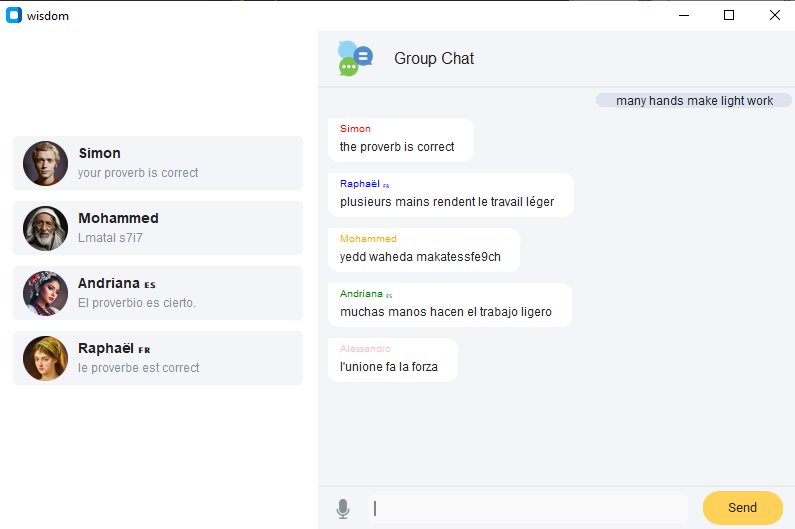
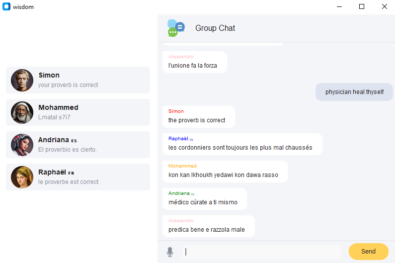
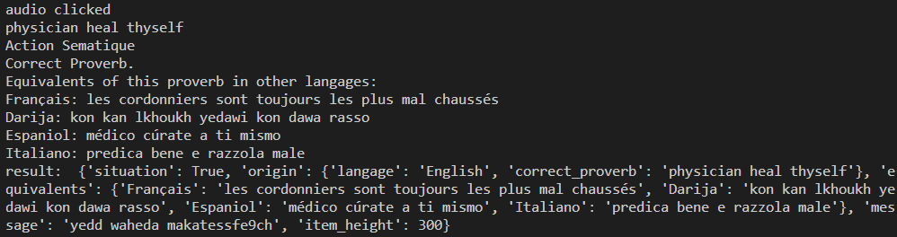
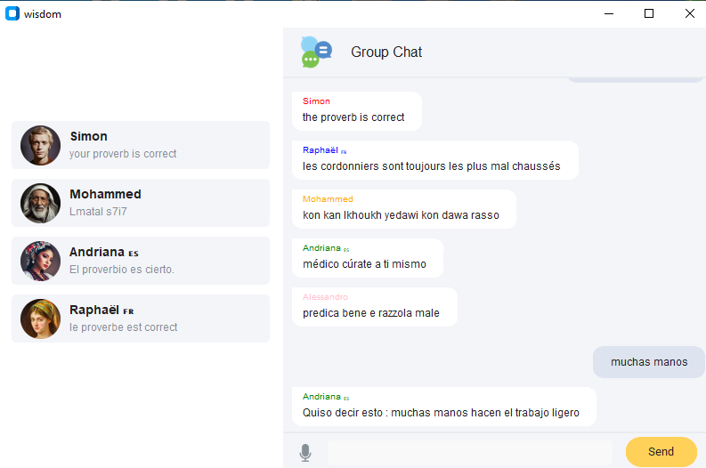

# Wisdom: Multilingual Proverbs Compiler
Wisdom is a multilingual proverbs compiler designed to work across five languages: French, English, Spanish, Italian, and Moroccan dialect (Darija). Leveraging lex and yacc, the project configures and processes the lexical, syntactic, and semantic aspects of each proverb and then it employs helper functions (helper_functions.py) and a proverbs object (proverbs_dictionary) to facilitate the equivalent in the meaning (not word to word translation) of proverbs across other cultures.

The user interface is crafted using tkinter, chosen for its resemblance to a chat application, enhancing user appeal and friendliness.

## How to Run:
1. Install the required packages listed in the **requirements.txt**
```
pip install -r requirements.txt
``` 
2. Navigate to the **GUI** directory:
```
cd gui
```
3. Run the **app.py** file:
```
python3 app.py
```

## How to use Wisdom:
1. Open the **proverbs_dictionary** file.
2. Inside the **proverbs** object, enter any proverb you'd like to test.
3. Run the application using the instructions provided earlier.
4. If the entered proverb is recognized and correct:
  * The application will return an "OK" message spoken by the native language speaker.
  * It will also display the equivalents of the proverb in other languages.
5. In case the proverb is incorrect or not recognized:
  * The native speaker will suggest the closest available proverb.
6. You can input the proverb by typing it into the provided field and clicking "Send".
  * Alternatively, you can utilize the microphone icon to activate the audio feature and speak the proverb aloud.

### Tests:
* OK by typing:

* OK by audio:

* What's in the terminal - Display the object recieve to display the situation(correct or wrong proverb, equivalents and the original proverb):

* Wrong proverbs:


## Team
This project was done by:  [karraamine](https://github.com/karraamine), [Oubayhe](https://github.com/Oubayhe), [Mouadspace](https://github.com/Mouadspace), [MedBenali0](https://github.com/MedBenali0)
